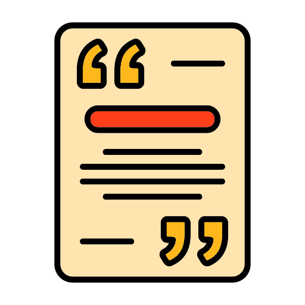
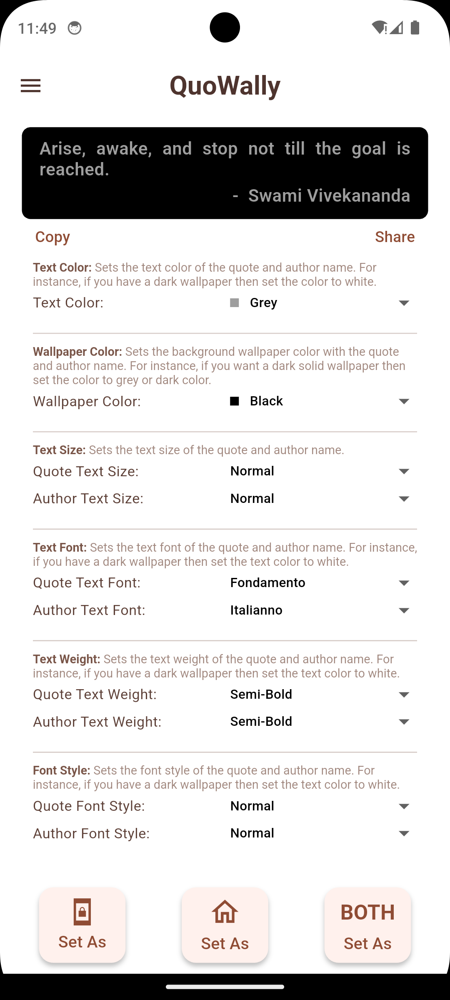
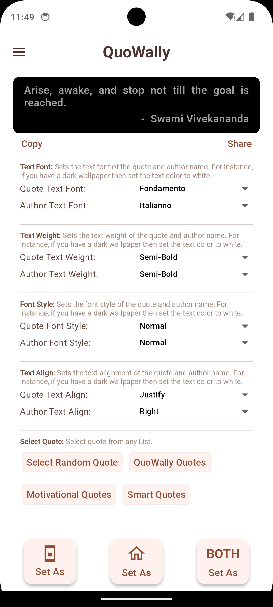
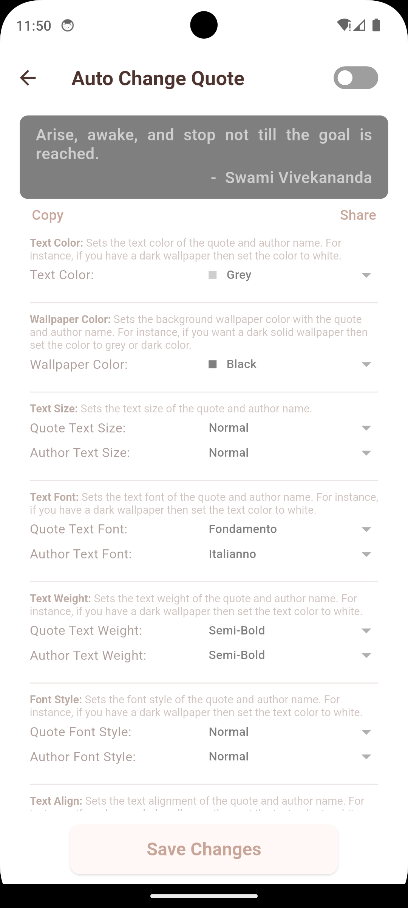

#  QuoWally – Quote Wallpaper App

QuoWally is a **Flutter**-based Android application that sets inspiring **quote wallpapers** on your device with customization options like font, color, background, and auto-change interval. It enables both prebuilt and user-generated quote lists, with options to favorite, style, and apply them as wallpapers for Home or Lock screen.

---

## ✨ Features

* 📜 View motivational quotes from Indian and global thinkers
* 🎨 Customize quote style: font, color, alignment, size
* ⏱️ Auto change wallpaper after set duration
* 💾 Save favorite quotes
* 🖼️ Apply quote as wallpaper (home, lock, or both)
* 🧠 Prebuilt quote lists + Custom user-added lists
* 🌓 Light mode interface

---

## 📂 Project Structure

```
QuoWally-main/
│
├── android/                      # Native Android config and Gradle files
├── ios/                         # (If applicable) iOS platform files
├── lib/                         # All Dart source code
│   ├── blocs/                   # BLoC (Business Logic Components) for state management
│   ├── data/provider/           # Data access providers (quote lists, stored data)
│   ├── models/                  # Data models: Quote, Style, List
│   ├── ui/screens/              # App Screens (Home, Quote List, Auto Config)
│   ├── ui/widgets/              # Reusable custom widgets
│   ├── utils/                   # Quote lists, styling presets, constants
│   ├── main.dart                # App entry point
│   └── app_bloc_observer.dart   # BLoC observer for logging/debugging
│
├── pubspec.yaml                 # Flutter dependencies and assets
├── README.md                    # Project readme (you're reading it!)
├── .gitignore, .metadata        # Git and IDE settings
```

---

## 🧠 Core Logic Overview

### `blocs/`

Contains BLoC logic for each domain:

* `author_bloc/`: Manages author style states.
* `auto_change_quote_bloc/`: Controls wallpaper auto-change toggle and interval.
* `quote_bloc/`: Main quote text and style manager.
* `quote_list_bloc/`: Quote list loader and handler (prebuilt/user).
* `wallpaper_bloc/`: State for wallpaper screen application logic.

### `models/`

Defines the structure of:

* `Quote`, `QuoteStyle`, `AuthorStyle`
* `QuoteList`: Group of quotes
* `StoredQuote`: Serializable quote with style
* `Wallpaper`: Wrapper model for display

### `ui/screens/`

* `home_screen.dart`: Central dashboard with current quote preview.
* `quotes_list_screen.dart`: Display and pick from quote lists.
* `auto_change_config_screen.dart`: Configure quote change interval.

### `ui/widgets/`

Widgets for:

* Custom styling tiles (font, color, alignment, etc.)
* Quote preview card
* Bottom navigation bar
* Share/Copy row
* Set wallpaper button

### `utils/`

* Predefined quotes: `quowally_quotes.dart`
* Constants for style tiles: `quote_styling_values.dart`
* Auto wallpaper options: `auto_change_quote_values.dart`

---

## 🛠️ Installation & Running

### 🔧 Prerequisites:

* Flutter SDK (3.x recommended)
* Android Studio or VS Code
* Android device/emulator

### 📦 Install:

```bash
git clone https://github.com/yourusername/QuoWally.git
cd QuoWally
flutter pub get
```

### ▶️ Run:

```bash
flutter run
```

---

## 📸 Screenshots


| Home Screen                          | Quote Styling                            | Auto Change                                |
| ------------------------------------ | ---------------------------------------- | ------------------------------------------ |
|  |  |  |

---

## 📦 Dependencies

Some key packages used:

* `flutter_bloc`: State management
* `hydrated_bloc`: Persistent state
* `google_fonts`: Font styling
* `path_provider`, `hive`: Local storage
* `wallpaper_manager_flutter`: Set wallpapers
* `flutter_colorpicker`: Color picker UI

Check `pubspec.yaml` for the complete list.

---
### 📜 License

This project is licensed under the **[Apache License 2.0](LICENSE.md)**.
© 2025 Ved Patel. You are free to use, modify, and distribute it under the terms of the license.

[](LICENSE.md)

---

